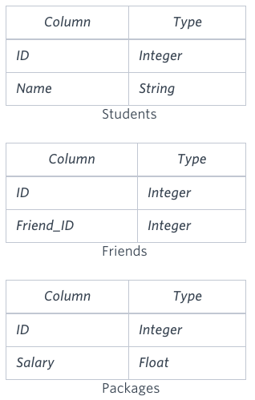
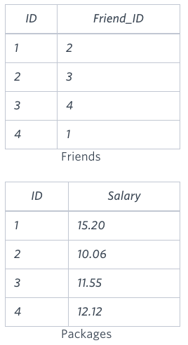
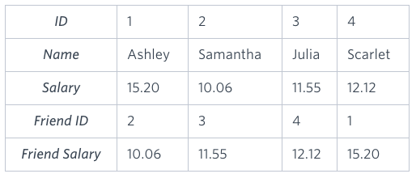

You are given three tables: Students, Friends and Packages. Students contains two columns: ID and Name. Friends contains two columns: ID and Friend_ID (ID of the ONLY best friend). Packages contains two columns: ID and Salary (offered salary in $ thousands per month).



Write a query to output the names of those students whose best friends got offered a higher salary than them. Names must be ordered by the salary amount offered to the best friends. It is guaranteed that no two students got same salary offer.

### Sample Input



### Sample Output

```
Samantha
Julia
Scarlet
```

### Explanation

See the following table:



Now,

Samantha's best friend got offered a higher salary than her at 11.55
Julia's best friend got offered a higher salary than her at 12.12
Scarlet's best friend got offered a higher salary than her at 15.2
Ashley's best friend did NOT get offered a higher salary than her
The name output, when ordered by the salary offered to their friends, will be:

Samantha
Julia
Scarlet

# Solution 

```
select s.name from students s
join Packages p1 on s.id = p1.id
join Friends f on s.id = f.id
join Packages p2 on p2.id = f.friend_id
where p1.salary < p2.salary
order by p2.salary;
```

